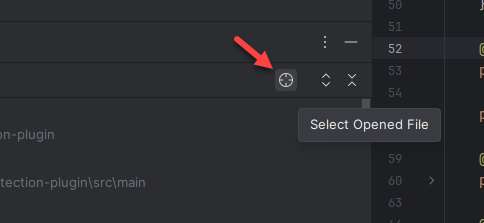

# GIT SCOPE (Intellij Plugin)

<!-- Plugin description -->

### Story

Developers rely on version control to review changes before committing. However, IntelliJ-based IDEs have a significant
limitation: after committing code, all change indicators in version control and line status annotations disappear
completely. Since feature branches typically contain multiple commits, this makes it difficult to track accumulated
changes over time. This plugin addresses that problem by making committed changes visible again.

Create custom "scopes" for any Git reference—branch, tag, or commit hash. Each defined scope appears as a selectable tab
in the **GIT SCOPE** tool window. The currently selected scope visualizes changes through:

- **Scope tree diff** — Shows all modified files in the GIT SCOPE tool window
- **File colors** - Files highlighted in editor tabs and project window according to the GIT SCOPE status (added;
  modified; deleted; ...)
- **Editor line status** — Displays change markers in the editor gutter for open files
- **Custom scope** — Enables filtered search, replace, and inspection operations
- **Status bar widget** — Displays the current scope selection

### Plugin Basics

The plugin will add a new tool window named **Git Scope**:


By default, it will appear as a secondary tool window on the left side, but you can move it anywhere to suit your
workflow. All features of this plugin are managed through the Git Scope tool window — no additional settings or
preferences are added. In other words; the plugin extends the GUI of the Jetbrains IDE.

### Plugin Features

 **New Scope:**

To add a new scope, click the "+" tab on the Git Scope panel:


In the "New*" tab you get a few different options to define the scope:


1. Select either a local or remote branch in the current repo. If the repo contains sub-repos, all repos will be listed
   with the main repo being the first repo in the list.
2. Alternatively, you can manually type the branch, tag or git reference and press Enter. A git reference can be any
   valid
   git reference such as `HEAD~2`, `<long hash>`, `<short hash>`, ...
3. If you want to bind the scope to the common ancestor for `HEAD` and the current selected scope reference, you can
   check the common ancestor checkbox. This makes it possible to for example select `master` and your scope will be
   compared to the common ancestor of `master` and `HEAD`. And you are free to pull new changes onto `master` without
   affecting the scope.
4. If the list of branches is long, it can be filtered using the search box.

 **Change Browser:**

Whenever the scope selection is done, the tab will turn into a "change browser" (similar to version control) that
displays the current diff of the **GIT SCOPE**.


Right click on any file will present a number of actions:


- **Show Diff**: Opens a diff window showing the diff of the selected file(s) `<selected-scope>..HEAD`
- **Show in Project**: Highlight this file in the Project tool window
- **Rollback...**: Rollback the selected files(s) to `<selected-scope>` version. Note that this will checkout the
  selected scope version of the file(s), and will in many cases leave you with a modified file that no longer show up in
  the Git Scope window since it is identical to the version pointed to by the scope. Commit the files using the
  standard Commit tool window.

 **Line Status Gutter:**

Adjusts the line status according to your **GIT SCOPE**. Normally this built-in feature shows only the current "HEAD"
changes

READ: https://www.jetbrains.com/help/phpstorm/file-status-highlights.html

| HEAD               | "main"-Branch            |
|--------------------|--------------------------|
|  |  |

 **Scope:**

Adds a custom *Scope* (used to do inspections, search/replace, etc), i.e. search results are filtered by **GIT SCOPE**.

READ: https://www.jetbrains.com/help/phpstorm/scopes.html


 **Status Bar Widget**

To see the current selection of the Git Scope even when the tool window is not open, you can look at the status bar
widget.


 **Rename Tab**

The tab name is per default set to the selected scope reference. If the selected scope is a git hash, you can rename the
scope tab name by right clicking on the tab and selecting "Rename Tab". Any renamed tab will show the original Git Scope
reference as a tooltip. You can rest the tab name to the original Git Scope scope reference by right clicking on the tab
and selecting "Reset Tab Name".


 **Use Commit as Git Scope**

In the Git panel, you can right-click on any commit and select "Use Commit as Git Scope" to automatically add the
commit as a new Git Scope.


 **Project Panel Filter**

The Project tool window can be filtered to show only files that are part of the current Git scope. When this filter is
enabled, the IDE controls the Project view’s lifecycle and updates. As a result, the Project tool window might not
immediately reflect changes to the Git scope.


 **Select In**

Git Scope appears in the Select In dialog, so you can locate any file directly in the Git Scope tool window from Select
In.


The Git Scope window itself also has the "Select Opened File" action button, so you can highlight any file directly in
the Git Scope tool window (if the file is part of the current selected scope):



## Shortcuts (Added by this Plugin)

| Shortcut | Description                                      |
|----------|--------------------------------------------------|
| Alt+H    | Toggle between HEAD and last Git Scope selection |

## More Useful Shortcuts

| Shortcut                                  | Description                    |
|-------------------------------------------|--------------------------------|
| Ctrl+D (on any file in a changes browser) | Open diff window               |
| F7                                        | step forward (in diff window)  |
| Shift+F7                                  | step backward (in diff window) |

### Notes

The examples above relies on the gutter highlighting feature in Jetbrains IDEs. Make sure that this feature is enabled
via `Tools -> Diff & Merge -> Highlight modified lines in gutter` (IntelliJ).

Previous versions of the plugin disabled this setting, while current versions rely on this setting being enabled to show
changes in gutter.

<!-- Plugin description end -->

# Howto build and debug

Build (build/distributions)

```bash
./gradlew buildPlugin
```

Run/debug plugin

```bash
./gradlew runIde
```

Verify

```bash
./gradlew verifyPlugin
```